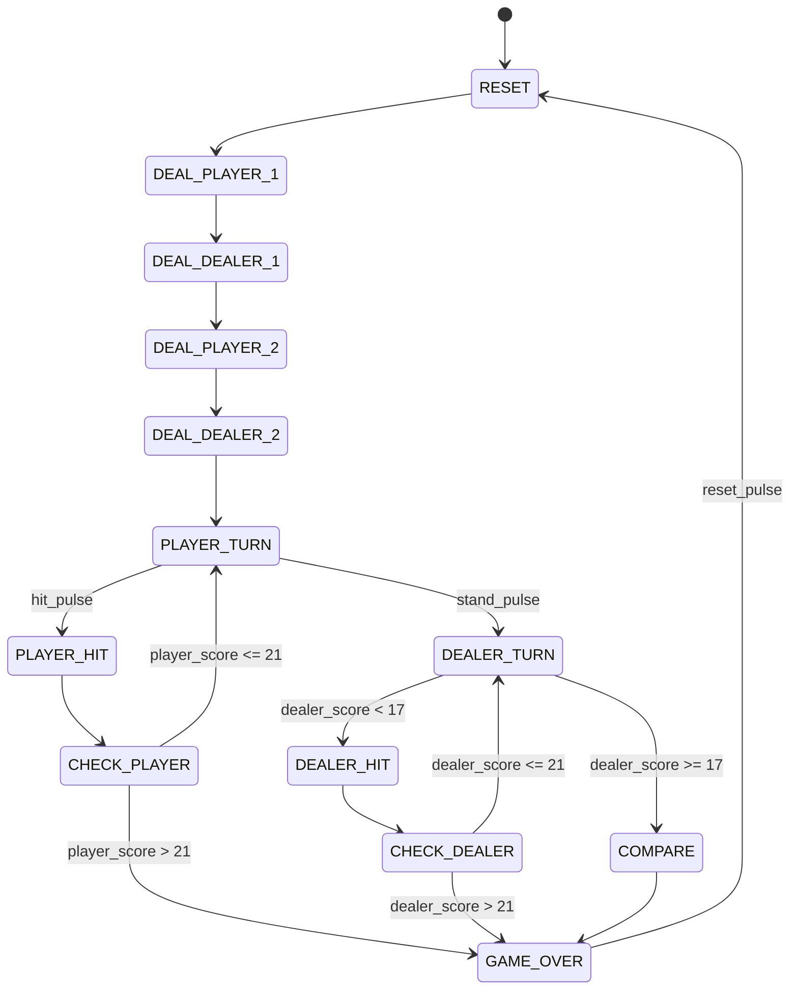

# Blackjack Finite State Machine

## Purpose

The Blackjack FSM controls the flow of the game.

It does not calculate scores, store cards, or display values.  
It only decides what happens next.

---

## Inputs to FSM

| Signal | Meaning |
|---|---|
| clk | System clock |
| reset_pulse | Start a new game |
| hit_pulse | Player requests another card |
| stand_pulse | Player ends turn |
| player_score | Current player score |
| dealer_score | Current dealer score |

---

## Outputs from FSM

| Signal | Meaning |
|---|---|
| clear_game | Clear all stored cards/scores |
| draw_player | Add one card to player hand |
| draw_dealer | Add one card to dealer hand |
| game_over | Game has ended |
| player_win | Player wins |
| dealer_win | Dealer wins |
| tie | Tie game |

---

## Planned States

| State | Purpose |
|---|---|
| RESET | Clear the game |
| DEAL_PLAYER_1 | Deal first player card |
| DEAL_DEALER_1 | Deal first dealer card |
| DEAL_PLAYER_2 | Deal second player card |
| DEAL_DEALER_2 | Deal second dealer card |
| PLAYER_TURN | Wait for player to hit or stand |
| PLAYER_HIT | Give player one card |
| CHECK_PLAYER | Check if player busted |
| DEALER_TURN | Dealer decides whether to draw |
| DEALER_HIT | Give dealer one card |
| CHECK_DEALER | Check dealer score |
| COMPARE | Compare player and dealer scores |
| GAME_OVER | Show final result |

---

## FSM Flow

---

## Important Design Rule

The FSM controls **when** actions happen.

The FSM does not store cards or calculate scores.

Examples:

- `draw_player = 1` means the hand manager should add a card to the player hand.
- `draw_dealer = 1` means the hand manager should add a card to the dealer hand.
- `clear_game = 1` means the hand manager should reset all stored cards.